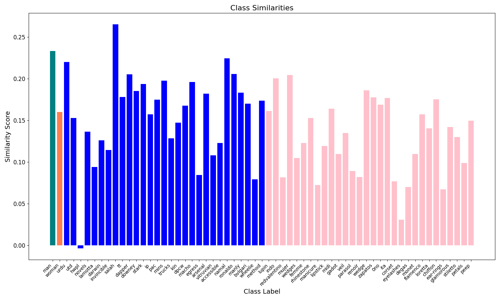

# Identifying Zero-Shot OpenClip Biases Via Network Analysis of Training Metadata





---
### Environment Setup

  ```bash
  conda create -n laiongraph python=3.9
  ```
  ```bash
  conda activate laiongraph
  ```
  ```bash
  pip install clip-benchmark pyarrow igraph pandas tqdm
  ```

### Downloading LAION400M
- To run the pipeline for building the graphs, you'll need to [download LAION400M separately](https://laion.ai/blog/laion-400-open-dataset/) and place it into a folder labeled laion400-meta
  ```bash
  cd graph/regex_handlers
  python vertex_builder_pipeline.py
  ```

### Loading the graphs
- I've provided 2 graphs in this repo. If you want to do analysis on any image, load one of the graphs following steps in eda.py, and follow the steps in similarity.py to generate your own graph.
- If you want to rerun the plots in this repo, you can simply run
  ```bash
  python similarity_graph_analysis.py
  ```
